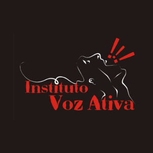
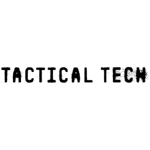
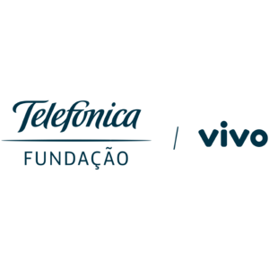

[Browse via Tor onion service](about/#browse-via-tor-onion-service)

Casa hacker is a non-profit hacker space dedicated to putting local communities in control of their digital experiences and shaping the future of information and communication technology for the public good. We put our principles above profit and believe that the technologies of our age are public resources to be exploited and built by everyone, not a commodity to be sold. In an experienced, multidisciplinary, technology and society leader we have developed social impact initiatives that empower people and transform communities.

We are community-based and from the suburb, passionate about technology, science, society and culture, and we believe that as technology is used to promote learning and justice, it is also used in ways that widen inequalities. Many people, especially those who have historically been excluded or marginalized, cannot access, build, benefit or influence digital platforms.

## Supporters, friends and partners:

             

## Location:

> Rua Benjamin Moloisi, 669 - Conj. Hab. Parque Itajai, Campinas - SP, 13058-020

<iframe width="425" height="350" frameborder="0" scrolling="no" marginheight="0" marginwidth="0" src="https://www.openstreetmap.org/export/embed.html?bbox=-47.193448841571815%2C-22.959894915812015%2C-47.19139426946641%2C-22.95839084833951&amp;layer=mapnik&amp;marker=-22.959142884166557%2C-47.192421555519104" style="border: 1px solid black"></iframe> <small><a href="https://www.openstreetmap.org/?mlat=-22.95914&amp;mlon=-47.19242#map=19/-22.95914/-47.19242" target="_blank">Click to open in a new tab</a></small>

## Social media:

   
