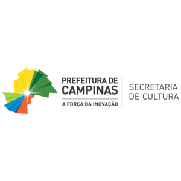
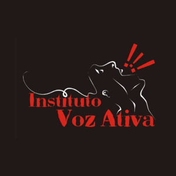
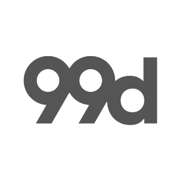
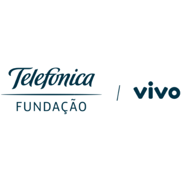
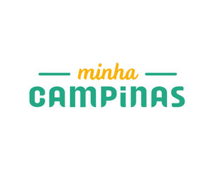

[English version](en/): on the top right corner there's a button to switch to the english version, if you are in your mobile click on the menu or click [here](en/)

[Acesse via serviço cebola (.onion)](about/#acesse-via-serviço-cebola-onion)

A Casa Hacker é um espaço hacker sem fins lucrativos e 100% dedicada a colocar comunidades locais no controle de suas experiências digitais e a moldarem o futuro da tecnologia da informação e comunicação para o bem público. Nós colocamos nossos princípios acima dos lucros e acreditamos que as tecnologias da nossa era são recursos públicos a serem explorados e construídos por todos, não uma mercadoria a ser vendida. Em um coletivo experiente, multidisciplinar e líder em tecnologia e sociedade desenvolvemos iniciativas de impacto social que empodera pessoas e transforma comunidades.

Somos de base comunitária e de raízes periféricas, apaixonados por tecnologia, ciência, sociedade e cultura, e acreditamos que na medida que a tecnologia em que é usada para promover a aprendizagem e justiça, ela também é usada de maneiras que amplificam as desigualdades. Muitas pessoas, especialmente aquelas que historicamente foram excluídas ou marginalizadas, não podem acessar, construir, beneficiar ou influenciar plataformas digitais.

## Apoiadores, amigos e parceiros

## Localização

Rua Benjamin Moloisi, 669 - Conj. Hab. Parque Itajai, Campinas - SP, 13058-020

<iframe width="425" height="350" frameborder="0" scrolling="no" marginheight="0" marginwidth="0" src="https://www.openstreetmap.org/export/embed.html?bbox=-47.193448841571815%2C-22.959894915812015%2C-47.19139426946641%2C-22.95839084833951&amp;layer=mapnik&amp;marker=-22.959142884166557%2C-47.192421555519104" style="border: 1px solid black"></iframe>

<small>
    <a href="https://www.openstreetmap.org/?mlat=-22.95914&amp;mlon=-47.19242#map=19/-22.95914/-47.19242" target="_blank">Clique para abrir em outra aba</a>
</small>

[Como chegar](/about/#como-chegar)